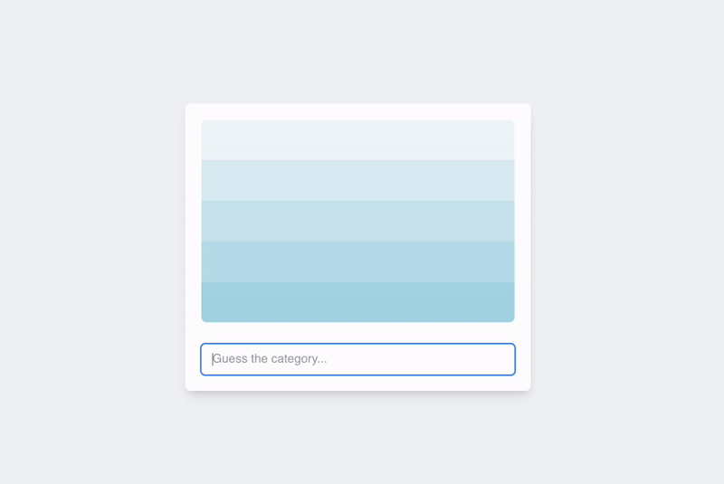

# Pinpoint - The Ultimate Category Guessing Game 🎯

Welcome to **Pinpoint**, a fun and engaging guessing game where your knowledge and intuition are put to the test! In this game, you'll use clues to guess the correct category. It's perfect for trivia enthusiasts and anyone who loves a challenge.

---

## 🌟 Features
- 🧠 **Challenge Your Knowledge**: Guess the hidden category based on a set of clues.
- ⏳ **Quick & Fun Gameplay**: Perfect for quick brain workouts or longer play sessions.
- 🎉 **Daily Challenges**: New puzzles every day to keep you engaged.
- 🌍 **Variety of Categories**: From movies and science to history and pop culture, there's something for everyone.

---

## 📸 Preview
Here’s a sneak peek of the game in action:

---

## 🚀 How to Play
1. **Visit the game**: [Pinpoint Daily](https://milad-mehri.github.io/pinpoint/)
2. **Start guessing**: Use the clues provided to figure out the hidden category.
3. **Challenge yourself**: Try to solve puzzles faster and with fewer guesses!

---
